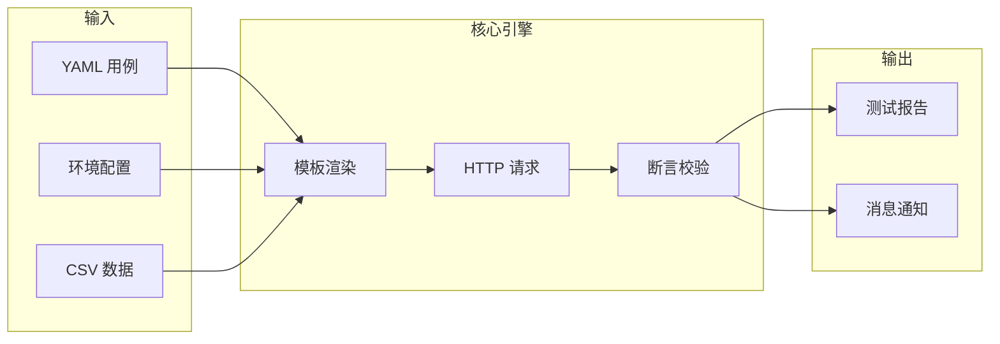

# 整体概览

## Drun 是什么？

**Drun** 是一个开源的 HTTP API 测试框架，采用零代码 YAML DSL 设计，支持接口自动化测试、数据驱动测试、CI/CD 集成等测试场景。简单易用，功能强大，开箱即用。



## 设计理念

相比于其它 API 测试工具，Drun 最大的不同在于设计理念：

- **零代码优先**：使用简洁的 YAML DSL 编写测试用例，无需编程知识
- **约定大于配置**：测试用例结构标准化，格式统一，方便协作和维护
- **CI/CD 原生**：内置 HTML/JSON/Allure 报告、消息通知、退出码，天然适配持续集成
- **Postman 式体验**：变量提取、环境管理、用例链式调用，熟悉的工作流
- **格式无关**：支持从 cURL/Postman/HAR/OpenAPI 导入，也可导出为 cURL

## 核心特性

### 测试能力

| 特性 | 说明 |
|------|------|
| **YAML DSL** | 直观的测试用例语法：`config` + `steps` |
| **Dollar 模板** | `$var` 和 `${func(...)}` 动态值渲染 |
| **丰富断言** | 19 种断言类型（eq/ne/lt/contains/regex/len_eq 等） |
| **数据驱动** | CSV 参数化批量测试 |
| **CSV 导出** | 将 API 响应数组导出为 CSV 文件 |
| **流式支持** | SSE (Server-Sent Events) 逐事件断言 |
| **文件上传** | Multipart/form-data 支持 |
| **用例调用** | invoke 嵌套调用，变量传递 |
| **质量评分** | 测试用例质量评估系统 |

### 变量管理

| 特性 | 说明 |
|------|------|
| **自动持久化** | 提取的变量自动保存到 `.env` 文件 |
| **智能命名** | `token` → `TOKEN`，`apiKey` → `API_KEY` 自动转换 |
| **内存传递** | 套件中用例间变量通过内存共享 |
| **环境文件** | 支持 `.env`、YAML 环境文件、系统环境变量 |

### 高级特性

| 特性 | 说明 |
|------|------|
| **自定义 Hooks** | Python 函数实现 setup/teardown 和请求签名 |
| **测试套件** | caseflow 有序执行，变量链式传递 |
| **认证支持** | Basic/Bearer 认证自动注入 |
| **标签过滤** | 布尔表达式如 `smoke and not slow` |
| **数据库断言** | MySQL 集成数据验证 |

### 报告与集成

| 特性 | 说明 |
|------|------|
| **HTML 报告** | 单文件、可分享的测试报告 |
| **JSON/Allure** | 结构化结果，适配 CI/CD 流水线 |
| **消息通知** | 飞书、钉钉、邮件失败告警 |
| **格式转换** | cURL/Postman/HAR/OpenAPI 导入导出 |
| **代码片段** | 自动生成可执行的 Shell 和 Python 脚本 |
| **报告服务器** | Web 界面实时查看 HTML 报告 |

## 内置函数

Drun 内置 17 个常用函数：

```yaml
# 时间/标识
${now()}           # ISO 8601 时间戳
${uuid()}          # UUID v4
${random_int(1, 100)}  # 随机整数

# 编码/加密
${base64_encode(str)}
${hmac_sha256(key, message)}

# Mock 数据 (Faker)
${fake_name()}         # 随机姓名
${fake_email()}        # 随机邮箱
${fake_phone_number()} # 随机电话
${fake_address()}      # 随机地址
${fake_city()}         # 随机城市
${fake_company()}      # 随机公司名
${fake_url()}          # 随机 URL
${fake_ipv4()}         # 随机 IPv4
${fake_user_agent()}   # 随机 UA
${fake_date()}         # 随机日期
${fake_text(100)}      # 随机文本
```

## 技术栈

| 依赖 | 版本 | 用途 |
|------|------|------|
| httpx | >=0.27 | 现代 HTTP 客户端 |
| pydantic | >=2.6 | 数据校验 |
| jmespath | >=1.0 | JSON 路径查询 |
| PyYAML | >=6.0 | YAML 解析 |
| rich | >=13.7 | 终端美化 |
| typer | >=0.12 | CLI 框架 |
| Faker | >=24.0 | Mock 数据生成 |

## 开源协议

Drun 采用 MIT 开源协议，商业友好，可永久免费使用。

## 相关链接

- **项目仓库**: https://github.com/Devliang24/drun
- **PyPI**: https://pypi.org/project/drun/
