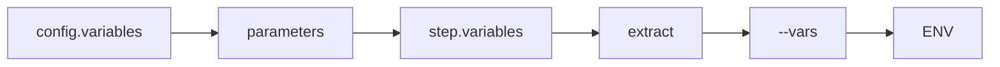

# 核心概念

Drun 的核心概念非常简洁，掌握以下几个概念即可上手使用。

## 测试用例（Case）

一条测试用例对应一个 YAML 文件，包含且仅包含两部分：

```yaml
config:    # 测试用例的公共配置
  name: 用户登录测试
  base_url: https://api.example.com
  tags: [smoke, auth]

steps:     # 有序步骤的集合
  - name: 步骤1
    request: ...
  - name: 步骤2
    request: ...
```

### config 配置项

| 字段 | 类型 | 说明 |
|------|------|------|
| `name` | string | 用例名称 |
| `base_url` | string | 基础 URL，步骤中可使用相对路径 |
| `tags` | list | 标签列表，用于过滤执行 |
| `variables` | dict | 全局变量 |
| `headers` | dict | 全局请求头 |
| `timeout` | float | 全局超时时间（秒） |
| `parameters` | list | 参数化数据源（CSV） |

### steps 步骤列表

每个步骤可以是两种类型之一：

1. **request 类型**：执行 HTTP 请求
2. **invoke 类型**：调用其他测试用例

## 测试步骤（Step）

### request 类型步骤

```yaml
steps:
  - name: 用户登录
    variables:           # 步骤局部变量
      username: admin
    request:             # HTTP 请求
      method: POST
      path: /api/login
      headers:
        Content-Type: application/json
      body:
        username: $username
        password: ${ENV(PASSWORD)}
    extract:             # 响应数据提取
      token: $.data.token
      userId: $.data.user.id
    validate:            # 结果断言
      - eq: [status_code, 200]
      - ne: [$.data.token, null]
    setup_hooks:         # 前置钩子
      - ${sign_request($request)}
    teardown_hooks:      # 后置钩子
      - ${cleanup()}
```

### invoke 类型步骤

```yaml
steps:
  - name: 执行登录流程
    variables:
      username: admin
    invoke: test_login   # 调用 testcases/test_login.yaml
```

### Step 字段说明

| 字段 | 类型 | 说明 |
|------|------|------|
| `name` | string | 步骤名称 |
| `variables` | dict | 步骤局部变量 |
| `request` | object | HTTP 请求配置 |
| `invoke` | string | 调用的用例路径 |
| `extract` | dict | 响应数据提取 |
| `validate` | list | 断言列表 |
| `export` | object | CSV 导出配置 |
| `setup_hooks` | list | 前置钩子函数 |
| `teardown_hooks` | list | 后置钩子函数 |
| `skip` | bool/string | 跳过条件 |
| `retry` | int | 重试次数 |
| `retry_backoff` | float | 重试间隔（指数退避） |

## 插件机制（Hooks）

Drun 通过 `drun_hooks.py` 文件实现自定义函数扩展。

### 文件位置

插件文件必须命名为 `drun_hooks.py`，放在项目根目录：

```
my-project/
├── drun_hooks.py      # 自定义函数
├── testcases/
└── .env
```

### 函数定义

```python
# drun_hooks.py
import hmac
import hashlib

def sign_request(hook_ctx):
    """请求签名"""
    secret = hook_ctx['env'].get('API_SECRET', '')
    body = hook_ctx.get('body', '')
    signature = hmac.new(
        secret.encode(),
        str(body).encode(),
        hashlib.sha256
    ).hexdigest()
    return {'signature': signature}

def get_timestamp():
    """获取时间戳"""
    import time
    return str(int(time.time()))
```

### 调用方式

```yaml
steps:
  - name: 签名请求
    setup_hooks:
      - ${sign_request($request)}
    request:
      method: POST
      path: /api/secure
      headers:
        X-Signature: $signature
```

## 测试工程目录结构

推荐的项目目录结构：

```
my-api-test/
├── testcases/           # 测试用例目录
│   ├── auth/
│   │   ├── test_login.yaml
│   │   └── test_logout.yaml
│   └── users/
│       └── test_create_user.yaml
├── testsuites/          # 测试套件目录
│   ├── testsuite_smoke.yaml
│   └── testsuite_e2e.yaml
├── data/                # 测试数据目录
│   └── users.csv
├── reports/             # 报告输出目录
├── logs/                # 日志输出目录
├── snippets/            # 代码片段目录
├── .env                 # 本地环境变量
├── .env.dev             # 开发环境
├── .env.prod            # 生产环境
├── drun_hooks.py        # 自定义钩子函数
└── .gitignore
```

## 变量系统

### 变量来源

Drun 支持多种变量来源，按优先级从低到高：



> 优先级从左到右递增，右侧变量会覆盖左侧同名变量。

### 变量引用

```yaml
# 简单变量引用
path: /users/$userId

# 表达式引用
path: /users/${userId}

# 函数调用
body:
  uuid: ${uuid()}
  timestamp: ${now()}

# 环境变量
headers:
  Authorization: Bearer ${ENV(TOKEN)}
  
# 带默认值的环境变量
base_url: ${ENV(BASE_URL, http://localhost:8080)}
```

### 变量自动持久化

提取的变量会自动保存到 `.env` 文件，并进行命名转换：

```yaml
extract:
  token: $.data.token      # → TOKEN=xxx
  userId: $.data.user.id   # → USER_ID=xxx
  apiKey: $.data.key       # → API_KEY=xxx
```

## 函数调用

### 语法格式

```yaml
${function_name()}              # 无参数
${function_name(arg)}           # 单参数
${function_name(arg1, arg2)}    # 多参数
${function_name($variable)}     # 变量作为参数
```

### 内置函数

| 函数 | 说明 | 示例 |
|------|------|------|
| `now()` | ISO 8601 时间戳 | `2025-01-01T12:00:00` |
| `uuid()` | UUID v4 | `550e8400-e29b-41d4...` |
| `random_int(min, max)` | 随机整数 | `${random_int(1, 100)}` |
| `base64_encode(str)` | Base64 编码 | `${base64_encode(hello)}` |
| `hmac_sha256(key, msg)` | HMAC SHA256 | `${hmac_sha256(secret, data)}` |
| `ENV(name)` | 环境变量 | `${ENV(TOKEN)}` |
| `ENV(name, default)` | 带默认值 | `${ENV(TOKEN, xxx)}` |
| `fake_name()` | 随机姓名 | `张三` |
| `fake_email()` | 随机邮箱 | `test@example.com` |
| `fake_phone_number()` | 随机电话 | `13800138000` |

### 自定义函数

在 `drun_hooks.py` 中定义的函数可直接调用：

```python
# drun_hooks.py
def get_auth_header(token):
    return f"Bearer {token}"
```

```yaml
# 测试用例中调用
headers:
  Authorization: ${get_auth_header($token)}
```
