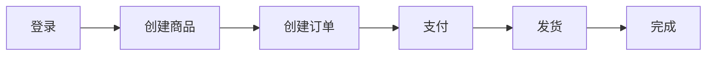

# 最佳实践

本文以 ERP 系统 API 测试为例，介绍 Drun 的最佳实践。

## 业务场景介绍

### ERP 系统概述

本示例基于一个典型的 ERP（企业资源计划）系统，包含以下核心模块：

- **用户管理**：注册、登录、权限控制
- **商品管理**：商品创建、查询、库存管理
- **订单管理**：订单创建、支付、发货、退款
- **报表统计**：销售报表、库存报表

### 核心 API

| 模块 | 接口 | 方法 | 说明 |
|------|------|------|------|
| 认证 | /api/auth/login | POST | 用户登录，返回 Token |
| 认证 | /api/auth/refresh | POST | 刷新 Token |
| 用户 | /api/users | POST | 创建用户 |
| 用户 | /api/users | GET | 用户列表 |
| 商品 | /api/products | POST | 创建商品 |
| 商品 | /api/products | GET | 商品列表 |
| 商品 | /api/products/{id} | GET | 商品详情 |
| 订单 | /api/orders | POST | 创建订单 |
| 订单 | /api/orders/{id} | GET | 订单详情 |
| 订单 | /api/orders/{id}/pay | POST | 订单支付 |
| 订单 | /api/orders/{id}/ship | POST | 订单发货 |

### 业务流程



---

## 1. 项目结构规范

### 推荐目录结构

```
erp-api-test/
├── testcases/              # 测试用例
│   ├── auth/               # 认证模块
│   │   ├── test_login.yaml
│   │   └── test_refresh_token.yaml
│   ├── users/              # 用户模块
│   │   ├── test_create_user.yaml
│   │   └── test_query_users.yaml
│   ├── products/           # 商品模块
│   │   ├── test_create_product.yaml
│   │   └── test_query_products.yaml
│   └── orders/             # 订单模块
│       ├── test_create_order.yaml
│       ├── test_pay_order.yaml
│       └── test_ship_order.yaml
├── testsuites/             # 测试套件
│   ├── testsuite_smoke.yaml
│   ├── testsuite_regression.yaml
│   └── testsuite_e2e.yaml
├── data/                   # 测试数据
│   ├── users.csv
│   └── products.csv
├── reports/                # 测试报告
├── logs/                   # 日志文件
├── .env.dev                # 开发环境
├── .env.uat                # 测试环境
├── .env.prod               # 生产环境
├── drun_hooks.py           # 钩子函数
└── .gitignore
```

### 文件命名规范

| 类型 | 命名规则 | 示例 |
|------|---------|------|
| 测试用例 | `test_<模块>_<功能>.yaml` | `test_order_create.yaml` |
| 测试套件 | `testsuite_<场景>.yaml` | `testsuite_smoke.yaml` |
| 数据文件 | `<数据类型>.csv` | `users.csv` |
| 环境文件 | `.env.<环境>` | `.env.dev` |

---

## 2. 用例编写规范

### 标准用例结构

```yaml
config:
  name: 创建订单          # 清晰的用例名称
  base_url: ${ENV(BASE_URL)}
  tags: [orders, smoke]   # 标签分类
  variables:
    timeout: 30

steps:
  - name: 创建订单
    request:
      method: POST
      path: /api/orders
      headers:
        Authorization: Bearer ${ENV(TOKEN)}
        Content-Type: application/json
      body:
        product_id: $productId
        quantity: 1
    extract:
      orderId: $.data.id
      orderNo: $.data.order_no
    validate:
      - eq: [status_code, 201]
      - eq: [$.code, 0]
      - ne: [$.data.id, null]
```

### 标签策略

| 标签 | 用途 | 执行频率 |
|------|------|---------|
| `smoke` | 冒烟测试，核心功能 | 每次提交 |
| `regression` | 回归测试，全量覆盖 | 每日构建 |
| `e2e` | 端到端，完整业务流程 | 发版前 |
| `slow` | 耗时测试 | 手动触发 |

### 用例命名

```yaml
# 好的命名
config:
  name: 创建订单 - 正常流程
  name: 创建订单 - 库存不足
  name: 创建订单 - 未登录

# 不好的命名
config:
  name: test1
  name: 订单
```

---

## 3. 变量管理

### 命名规范

用例中使用小写下划线，自动转换为大写环境变量：

```yaml
# 用例中提取（小写下划线）
extract:
  order_id: $.data.id        # → ORDER_ID
  access_token: $.data.token # → ACCESS_TOKEN

# 后续用例使用（大写）
variables:
  order_id: ${ENV(ORDER_ID)}
```

### 变量分层

```yaml
config:
  variables:
    # 全局默认值
    page_size: 10
    timeout: 30

steps:
  - name: 查询订单
    variables:
      # 步骤级覆盖
      page_size: 20
    request:
      params:
        size: $page_size    # 实际值: 20
```

### 跨用例变量传递

**方式一：环境变量持久化**

```bash
# 用例 A 提取并持久化
drun r test_login --env dev
# TOKEN 自动写入 .env.dev

# 用例 B 直接使用
drun r test_create_order --env dev
# 自动读取 TOKEN
```

**方式二：套件内内存传递**

```yaml
# testsuite_e2e.yaml
caseflow:
  - name: 登录
    invoke: auth/test_login
    # 自动导出: token, userId

  - name: 创建订单
    variables:
      user_id: $userId
    invoke: orders/test_create_order
```

---

## 4. 数据驱动测试

### CSV 文件组织

```
data/
├── users.csv           # 用户测试数据
├── products.csv        # 商品测试数据
└── orders/
    ├── normal.csv      # 正常订单场景
    └── edge_cases.csv  # 边界场景
```

### CSV 示例

**data/users.csv**
```csv
username,email,role,expected_code,expected_msg
admin,admin@erp.com,admin,201,创建成功
test_user,test@erp.com,user,201,创建成功
,empty@erp.com,user,400,用户名不能为空
duplicate,admin@erp.com,user,409,邮箱已存在
```

### 参数化用例

```yaml
config:
  name: 批量创建用户
  parameters:
    - csv:
        path: data/users.csv

steps:
  - name: "创建用户: $username"
    request:
      method: POST
      path: /api/users
      body:
        username: $username
        email: $email
        role: $role
    validate:
      - eq: [status_code, $expected_code]
      - contains: [$.message, $expected_msg]
```

---

## 5. 钩子函数规范

### 命名规范

```python
# drun_hooks.py

# 前置钩子：setup_hook_<功能>
def setup_hook_sign_request(hook_ctx):
    """请求签名"""
    pass

def setup_hook_refresh_token(hook_ctx):
    """刷新 Token"""
    pass

# 后置钩子：teardown_hook_<功能>
def teardown_hook_cleanup(hook_ctx):
    """清理测试数据"""
    pass

# 工具函数：<动词>_<名词>
def generate_order_no():
    """生成订单号"""
    pass

def format_timestamp(fmt="%Y-%m-%d"):
    """格式化时间"""
    pass
```

### ERP 常用钩子

```python
import time
import hmac
import hashlib
import uuid

def generate_order_no():
    """生成订单号：ORD + 时间戳 + 随机数"""
    return f"ORD{int(time.time())}{uuid.uuid4().hex[:6].upper()}"

def setup_hook_api_sign(hook_ctx):
    """API 签名"""
    app_key = hook_ctx['env'].get('APP_KEY', '')
    app_secret = hook_ctx['env'].get('APP_SECRET', '')
    timestamp = str(int(time.time()))
    
    sign_str = f"{app_key}{timestamp}{app_secret}"
    signature = hashlib.md5(sign_str.encode()).hexdigest()
    
    return {
        'timestamp': timestamp,
        'signature': signature
    }

def teardown_hook_delete_test_data(hook_ctx):
    """清理测试数据"""
    response = hook_ctx.get('response', {})
    order_id = response.get('body', {}).get('data', {}).get('id')
    if order_id:
        # 记录待清理的数据
        print(f"[CLEANUP] Order ID: {order_id}")
```

---

## 6. 测试套件组织

### 冒烟测试套件

```yaml
# testsuites/testsuite_smoke.yaml
config:
  name: ERP 冒烟测试
  tags: [smoke]

caseflow:
  - name: 健康检查
    invoke: test_health

  - name: 用户登录
    invoke: auth/test_login

  - name: 商品查询
    invoke: products/test_query_products

  - name: 订单查询
    invoke: orders/test_query_orders
```

### E2E 测试套件

```yaml
# testsuites/testsuite_e2e.yaml
config:
  name: ERP 端到端流程
  tags: [e2e]

caseflow:
  - name: 管理员登录
    invoke: auth/test_login

  - name: 创建商品
    invoke: products/test_create_product
    # 导出: productId, productName

  - name: 创建订单
    variables:
      product_id: $productId
    invoke: orders/test_create_order
    # 导出: orderId, orderNo

  - name: 订单支付
    variables:
      order_id: $orderId
    invoke: orders/test_pay_order

  - name: 订单发货
    variables:
      order_id: $orderId
    invoke: orders/test_ship_order

  - name: 验证订单状态
    variables:
      order_id: $orderId
      expected_status: completed
    invoke: orders/test_verify_order
```

---

## 7. 断言最佳实践

### 推荐做法

```yaml
validate:
  # 1. 状态码断言
  - eq: [status_code, 200]
  
  # 2. 业务码断言
  - eq: [$.code, 0]
  
  # 3. 具体字段断言
  - eq: [$.data.status, paid]
  - ne: [$.data.id, null]
  
  # 4. 数值范围断言
  - gt: [$.data.total, 0]
  - le: [$.data.amount, 10000]
  
  # 5. 列表长度断言
  - gt: [$.data.items | length(@), 0]
```

### 避免的做法

```yaml
validate:
  # 避免：断言整个数组
  - eq: [$.data.items, []]
  
  # 避免：断言整个对象
  - eq: [$.data, {id: 1, name: test}]
  
  # 避免：断言不稳定的值
  - eq: [$.data.created_at, 2025-01-01]
```

### 分层断言

```yaml
validate:
  # 协议层
  - eq: [status_code, 200]
  
  # 业务层
  - eq: [$.code, 0]
  - eq: [$.message, success]
  
  # 数据层
  - ne: [$.data, null]
  - eq: [$.data.order_status, paid]
  - gt: [$.data.amount, 0]
```

---

## 8. 环境配置

### 多环境管理

```bash
# .env.dev - 开发环境
BASE_URL=https://dev-api.erp.com
APP_KEY=dev-key
APP_SECRET=dev-secret
DB_HOST=dev-db.erp.com

# .env.uat - 测试环境
BASE_URL=https://uat-api.erp.com
APP_KEY=uat-key
APP_SECRET=uat-secret
DB_HOST=uat-db.erp.com

# .env.prod - 生产环境（只读测试）
BASE_URL=https://api.erp.com
APP_KEY=prod-key
APP_SECRET=prod-secret
```

### 敏感信息处理

```bash
# .gitignore
.env
.env.*
!.env.example

# .env.example（提交到仓库的模板）
BASE_URL=https://api.erp.com
APP_KEY=your-app-key
APP_SECRET=your-app-secret
TOKEN=your-token
```

### 运行时脱敏

```bash
# CI/CD 环境启用脱敏
drun r testcases --env ci --mask-secrets --html report.html
```

---

## 9. 调试技巧

### 日志级别

```bash
# 正常运行
drun r test_order --env dev

# 调试模式
drun r test_order --env dev --log-level DEBUG

# 显示敏感信息（本地调试）
drun r test_order --env dev --reveal-secrets

# 显示响应头
drun r test_order --env dev --response-headers

# 完整调试
drun r test_order --env dev \
  --log-level DEBUG \
  --reveal-secrets \
  --response-headers
```

### 常见问题排查

| 问题 | 排查方法 |
|------|---------|
| 变量未替换 | 检查变量名大小写、作用域 |
| 断言失败 | 查看 DEBUG 日志中的实际值 |
| 提取失败 | 确认 JMESPath 路径正确 |
| 401 错误 | 检查 Token 是否过期 |
| 连接超时 | 检查 BASE_URL 和网络 |

### 单步调试

```bash
# 只运行特定步骤的用例
drun r test_order --env dev -k "创建订单"

# 快速失败，定位问题
drun r testcases --env dev --failfast
```

---

## 10. CI/CD 集成

### GitHub Actions

```yaml
# .github/workflows/api-tests.yml
name: API Tests

on:
  push:
    branches: [main, develop]
  pull_request:
    branches: [main]
  schedule:
    - cron: '0 2 * * *'  # 每天凌晨 2 点

jobs:
  smoke-test:
    runs-on: ubuntu-latest
    steps:
      - uses: actions/checkout@v3
      
      - uses: actions/setup-python@v4
        with:
          python-version: '3.10'
      
      - name: Install Drun
        run: pip install drun
      
      - name: Setup Environment
        run: |
          cat > .env.ci << EOF
          BASE_URL=${{ secrets.BASE_URL }}
          APP_KEY=${{ secrets.APP_KEY }}
          APP_SECRET=${{ secrets.APP_SECRET }}
          EOF
      
      - name: Run Smoke Tests
        run: |
          drun r testsuite_smoke --env ci \
            --html reports/smoke.html \
            --mask-secrets \
            --failfast
      
      - name: Upload Reports
        uses: actions/upload-artifact@v3
        if: always()
        with:
          name: test-reports
          path: reports/
```

### 报告归档

```bash
# 按日期归档
reports/
├── 2025-01/
│   ├── smoke-20250101.html
│   └── smoke-20250102.html
└── 2025-02/
    └── smoke-20250201.html

# 清理 30 天前的报告
find reports/ -name "*.html" -mtime +30 -delete
```

---

## 总结

| 实践领域 | 核心要点 |
|---------|---------|
| 项目结构 | 按模块组织，命名规范统一 |
| 用例编写 | 清晰命名，合理标签，结构标准 |
| 变量管理 | 小写命名，自动转换，分层管理 |
| 数据驱动 | CSV 组织清晰，场景覆盖全面 |
| 钩子函数 | 命名规范，职责单一 |
| 测试套件 | 分层组织，变量链式传递 |
| 断言规范 | 具体字段，避免整体断言 |
| 环境配置 | 多环境隔离，敏感信息脱敏 |
| 调试技巧 | 善用日志，快速定位 |
| CI/CD | 自动化执行，报告归档 |
