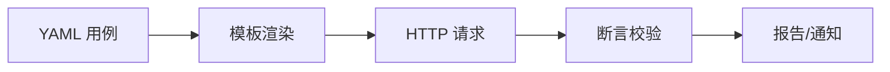
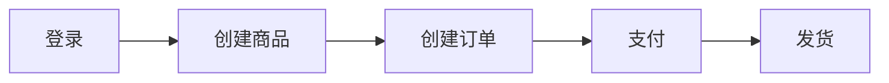
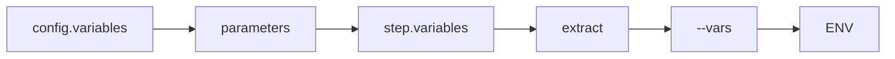

# 最佳实践

本文介绍 Drun 框架的设计思想、核心使用方法，并以 ERP 系统 API 测试为例展示最佳实践。

---

## 框架设计思想

### 核心理念

| 理念 | 说明 |
|------|------|
| **零代码优先** | 使用 YAML DSL 编写测试用例，无需编程知识 |
| **约定大于配置** | 标准化目录结构和文件命名，开箱即用 |
| **Postman 式体验** | 变量提取自动持久化、环境管理、用例链式调用 |
| **CI/CD 原生** | 内置报告、通知、退出码，天然适配持续集成 |

### 执行流程



### 用例结构

每个测试用例由两部分组成：

```yaml
config:       # 配置：名称、环境、变量、标签
  name: 用例名称
  base_url: ${ENV(BASE_URL)}
  tags: [smoke]

steps:        # 步骤：请求、提取、断言
  - name: 步骤名称
    request: ...
    extract: ...
    validate: ...
```

---

## 核心使用方法

### 快速开始

```bash
# 1. 安装
pip install drun

# 2. 创建项目
drun init myproject && cd myproject

# 3. 配置环境
echo "BASE_URL=https://api.example.com" > .env.dev

# 4. 运行测试
drun r testcases --env dev
```

### 常用命令速查

| 命令 | 说明 |
|------|------|
| `drun init <name>` | 创建项目 |
| `drun r <path> --env <env>` | 运行测试 |
| `drun r testcases -k "smoke"` | 标签过滤 |
| `drun r testcases --html report.html` | 生成报告 |
| `drun convert xxx.curl` | cURL 转换 |
| `drun s` | 启动报告服务器 |

### 模板语法

```yaml
# 变量引用
path: /users/$userId
path: /users/${userId}

# 函数调用
body:
  uuid: ${uuid()}
  time: ${now()}
  name: ${fake_name()}

# 环境变量
headers:
  Authorization: Bearer ${ENV(TOKEN)}
```

---

## 业务场景介绍

本文以 ERP（企业资源计划）系统为例，包含以下模块：

- **用户管理**：注册、登录、权限
- **商品管理**：创建、查询、库存
- **订单管理**：创建、支付、发货

### 核心 API

| 模块 | 接口 | 方法 | 说明 |
|------|------|------|------|
| 认证 | /api/auth/login | POST | 用户登录 |
| 商品 | /api/products | POST | 创建商品 |
| 商品 | /api/products | GET | 商品列表 |
| 订单 | /api/orders | POST | 创建订单 |
| 订单 | /api/orders/{id}/pay | POST | 订单支付 |

### 业务流程



---

## 1. 项目结构规范

### 推荐目录结构

```
erp-api-test/
├── testcases/                  # 测试用例目录
│   ├── auth/                   # 认证模块
│   │   ├── test_login.yaml
│   │   └── test_logout.yaml
│   ├── products/               # 商品模块
│   │   └── test_create_product.yaml
│   └── orders/                 # 订单模块
│       ├── test_create_order.yaml
│       └── test_pay_order.yaml
├── testsuites/                 # 测试套件目录
│   ├── testsuite_smoke.yaml
│   └── testsuite_e2e.yaml
├── data/                       # 测试数据目录
│   ├── users.csv
│   └── products.csv
├── reports/                    # 报告输出目录
├── logs/                       # 日志输出目录
├── snippets/                   # 代码片段目录
├── .env.dev                    # 开发环境配置
├── .env.uat                    # 测试环境配置
├── .env.prod                   # 生产环境配置
├── drun_hooks.py               # 自定义钩子函数
└── .gitignore
```

### 目录说明

| 目录/文件 | 用途 | 说明 |
|-----------|------|------|
| `testcases/` | 测试用例 | 按业务模块分子目录，文件命名 `test_*.yaml` |
| `testsuites/` | 测试套件 | 编排多用例流程，文件命名 `testsuite_*.yaml` |
| `data/` | 测试数据 | CSV 参数化数据文件 |
| `reports/` | 测试报告 | 自动生成的 HTML/JSON 报告 |
| `logs/` | 日志文件 | 测试执行日志 |
| `snippets/` | 代码片段 | 自动生成的 cURL/Python 脚本 |
| `.env.*` | 环境配置 | 不同环境的变量配置 |
| `drun_hooks.py` | 钩子函数 | 自定义 Python 函数扩展 |

### 文件命名规范

| 类型 | 命名规则 | 示例 |
|------|---------|------|
| 测试用例 | `test_<模块>_<功能>.yaml` | `test_order_create.yaml` |
| 测试套件 | `testsuite_<场景>.yaml` | `testsuite_smoke.yaml` |
| 数据文件 | `<数据类型>.csv` | `users.csv` |
| 环境文件 | `.env.<环境>` | `.env.dev` |

---

## 2. 用例编写规范

### 标准用例结构

```yaml
config:
  name: 创建订单                    # 清晰的用例名称
  base_url: ${ENV(BASE_URL)}
  tags: [orders, smoke]             # 标签分类
  variables:
    timeout: 30

steps:
  - name: 创建订单
    request:
      method: POST
      path: /api/orders
      headers:
        Authorization: Bearer ${ENV(TOKEN)}
        Content-Type: application/json
      body:
        product_id: $productId
        quantity: 1
    extract:
      orderId: $.data.id
      orderNo: $.data.order_no
    validate:
      - eq: [status_code, 201]
      - eq: [$.code, 0]
      - ne: [$.data.id, null]
```

### 标签策略

| 标签 | 用途 | 执行频率 |
|------|------|---------|
| `smoke` | 冒烟测试，核心功能 | 每次提交 |
| `regression` | 回归测试，全量覆盖 | 每日构建 |
| `e2e` | 端到端，完整业务流程 | 发版前 |
| `slow` | 耗时测试 | 手动触发 |

### 用例命名

```yaml
# 好的命名
config:
  name: 创建订单 - 正常流程
  name: 创建订单 - 库存不足
  name: 创建订单 - 未登录

# 不好的命名
config:
  name: test1
  name: 订单
```

---

## 3. 变量管理

### 命名规范

用例中使用小写下划线，自动转换为大写环境变量：

```yaml
# 用例中提取（小写下划线）
extract:
  order_id: $.data.id        # → ORDER_ID
  access_token: $.data.token # → ACCESS_TOKEN

# 后续用例使用（大写）
variables:
  order_id: ${ENV(ORDER_ID)}
```

### 变量优先级



> 优先级从左到右递增，右侧变量会覆盖左侧同名变量。

### 跨用例变量传递

**方式一：环境变量持久化**

```bash
# 用例 A 提取并持久化
drun r test_login --env dev
# TOKEN 自动写入 .env.dev

# 用例 B 直接使用
drun r test_create_order --env dev
# 自动读取 TOKEN
```

**方式二：套件内内存传递**

```yaml
# testsuite_e2e.yaml
caseflow:
  - name: 登录
    invoke: auth/test_login
    # 自动导出: token, userId

  - name: 创建订单
    variables:
      user_id: $userId
    invoke: orders/test_create_order
```

---

## 4. 数据驱动测试

### CSV 文件组织

```
data/
├── users.csv           # 用户测试数据
├── products.csv        # 商品测试数据
└── orders/
    ├── normal.csv      # 正常订单场景
    └── edge_cases.csv  # 边界场景
```

### CSV 示例

**data/users.csv**
```csv
username,email,role,expected_code,expected_msg
admin,admin@erp.com,admin,201,创建成功
test_user,test@erp.com,user,201,创建成功
,empty@erp.com,user,400,用户名不能为空
duplicate,admin@erp.com,user,409,邮箱已存在
```

### 参数化用例

```yaml
config:
  name: 批量创建用户
  parameters:
    - csv:
        path: data/users.csv

steps:
  - name: "创建用户: $username"
    request:
      method: POST
      path: /api/users
      body:
        username: $username
        email: $email
        role: $role
    validate:
      - eq: [status_code, $expected_code]
      - contains: [$.message, $expected_msg]
```

---

## 5. 钩子函数规范

### 命名规范

```python
# drun_hooks.py

# 前置钩子：setup_hook_<功能>
def setup_hook_sign_request(hook_ctx):
    """请求签名"""
    pass

# 后置钩子：teardown_hook_<功能>
def teardown_hook_cleanup(hook_ctx):
    """清理测试数据"""
    pass

# 工具函数：<动词>_<名词>
def generate_order_no():
    """生成订单号"""
    pass
```

### 常用钩子示例

```python
import time
import hashlib
import uuid

def generate_order_no():
    """生成订单号"""
    return f"ORD{int(time.time())}{uuid.uuid4().hex[:6].upper()}"

def setup_hook_api_sign(hook_ctx):
    """API 签名"""
    app_key = hook_ctx['env'].get('APP_KEY', '')
    app_secret = hook_ctx['env'].get('APP_SECRET', '')
    timestamp = str(int(time.time()))
    
    sign_str = f"{app_key}{timestamp}{app_secret}"
    signature = hashlib.md5(sign_str.encode()).hexdigest()
    
    return {'timestamp': timestamp, 'signature': signature}
```

---

## 6. 测试套件组织

### 冒烟测试套件

```yaml
config:
  name: ERP 冒烟测试
  tags: [smoke]

caseflow:
  - name: 用户登录
    invoke: auth/test_login

  - name: 商品查询
    invoke: products/test_query_products

  - name: 订单查询
    invoke: orders/test_query_orders
```

### E2E 测试套件

```yaml
config:
  name: ERP 端到端流程
  tags: [e2e]

caseflow:
  - name: 管理员登录
    invoke: auth/test_login

  - name: 创建商品
    invoke: products/test_create_product
    # 导出: productId

  - name: 创建订单
    variables:
      product_id: $productId
    invoke: orders/test_create_order
    # 导出: orderId

  - name: 订单支付
    variables:
      order_id: $orderId
    invoke: orders/test_pay_order
```

---

## 7. 断言最佳实践

### 推荐做法

```yaml
validate:
  # 状态码
  - eq: [status_code, 200]
  
  # 业务码
  - eq: [$.code, 0]
  
  # 具体字段
  - eq: [$.data.status, paid]
  - ne: [$.data.id, null]
  
  # 数值范围
  - gt: [$.data.total, 0]
  
  # 列表长度
  - gt: [$.data.items | length(@), 0]
```

### 避免的做法

```yaml
validate:
  # 避免：断言整个数组/对象
  - eq: [$.data.items, []]
  - eq: [$.data, {id: 1, name: test}]
  
  # 避免：断言不稳定的值
  - eq: [$.data.created_at, 2025-01-01]
```

---

## 8. 环境配置

### 多环境管理

```bash
# .env.dev - 开发环境
BASE_URL=https://dev-api.erp.com
APP_KEY=dev-key
APP_SECRET=dev-secret

# .env.uat - 测试环境
BASE_URL=https://uat-api.erp.com
APP_KEY=uat-key
APP_SECRET=uat-secret

# .env.prod - 生产环境
BASE_URL=https://api.erp.com
APP_KEY=prod-key
APP_SECRET=prod-secret
```

### 敏感信息处理

```bash
# .gitignore
.env
.env.*
!.env.example

# CI/CD 环境启用脱敏
drun r testcases --env ci --mask-secrets
```

---

## 9. 调试技巧

### 日志级别

```bash
# 正常运行
drun r test_order --env dev

# 调试模式
drun r test_order --env dev --log-level DEBUG

# 显示敏感信息
drun r test_order --env dev --reveal-secrets

# 完整调试
drun r test_order --env dev --log-level DEBUG --reveal-secrets --response-headers
```

### 常见问题

| 问题 | 排查方法 |
|------|---------|
| 变量未替换 | 检查变量名大小写、作用域 |
| 断言失败 | 查看 DEBUG 日志中的实际值 |
| 提取失败 | 确认 JMESPath 路径正确 |
| 401 错误 | 检查 Token 是否过期 |

---

## 10. CI/CD 集成

### GitHub Actions

```yaml
name: API Tests

on: [push, pull_request]

jobs:
  test:
    runs-on: ubuntu-latest
    steps:
      - uses: actions/checkout@v3
      - uses: actions/setup-python@v4
        with:
          python-version: '3.10'
      
      - name: Install & Run
        run: |
          pip install drun
          echo "BASE_URL=${{ secrets.BASE_URL }}" > .env.ci
          drun r testsuite_smoke --env ci --html reports/report.html --mask-secrets
      
      - name: Upload Reports
        uses: actions/upload-artifact@v3
        if: always()
        with:
          name: test-reports
          path: reports/
```

---

## 11. 代码片段

### 自动生成

运行测试时，Drun 自动生成可执行的 cURL 和 Python 脚本：

```bash
drun r test_login --env dev

# 自动生成:
# snippets/20250101-120000/step1_登录_curl.sh
# snippets/20250101-120000/step1_登录_python.py
```

### 生成的文件

**cURL 脚本**
```bash
#!/bin/bash
curl -X POST 'https://api.erp.com/api/auth/login' \
  -H 'Content-Type: application/json' \
  -d '{"username": "admin", "password": "123456"}'
```

**Python 脚本**
```python
import httpx

response = httpx.post(
    'https://api.erp.com/api/auth/login',
    headers={'Content-Type': 'application/json'},
    json={'username': 'admin', 'password': '123456'}
)
print(response.status_code)
print(response.json())
```

### 控制选项

```bash
# 禁用生成
drun r testcases --env dev --no-snippet

# 仅生成 cURL
drun r testcases --env dev --snippet-lang curl

# 仅生成 Python
drun r testcases --env dev --snippet-lang python

# 自定义输出目录
drun r testcases --env dev --snippet-output exports/
```

### 使用场景

| 场景 | 说明 |
|------|------|
| 问题复现 | 直接执行 cURL 复现接口问题 |
| 开发联调 | 分享给开发快速调试 |
| 文档补充 | 作为 API 调用示例 |
| 自动化脚本 | 集成到其他系统 |

### 目录管理

```bash
# 清理 7 天前的片段
find snippets/ -type d -mtime +7 -exec rm -rf {} +
```

---

## 总结

| 实践领域 | 核心要点 |
|---------|---------|
| 设计思想 | 零代码、约定大于配置、Postman 式体验 |
| 项目结构 | 按模块组织，命名规范统一 |
| 用例编写 | 清晰命名，合理标签，结构标准 |
| 变量管理 | 小写命名，自动转换，分层管理 |
| 数据驱动 | CSV 组织清晰，场景覆盖全面 |
| 钩子函数 | 命名规范，职责单一 |
| 测试套件 | 分层组织，变量链式传递 |
| 断言规范 | 具体字段，避免整体断言 |
| 环境配置 | 多环境隔离，敏感信息脱敏 |
| 调试技巧 | 善用日志，快速定位 |
| CI/CD | 自动化执行，报告归档 |
| 代码片段 | 自动生成，便于复现和联调 |
